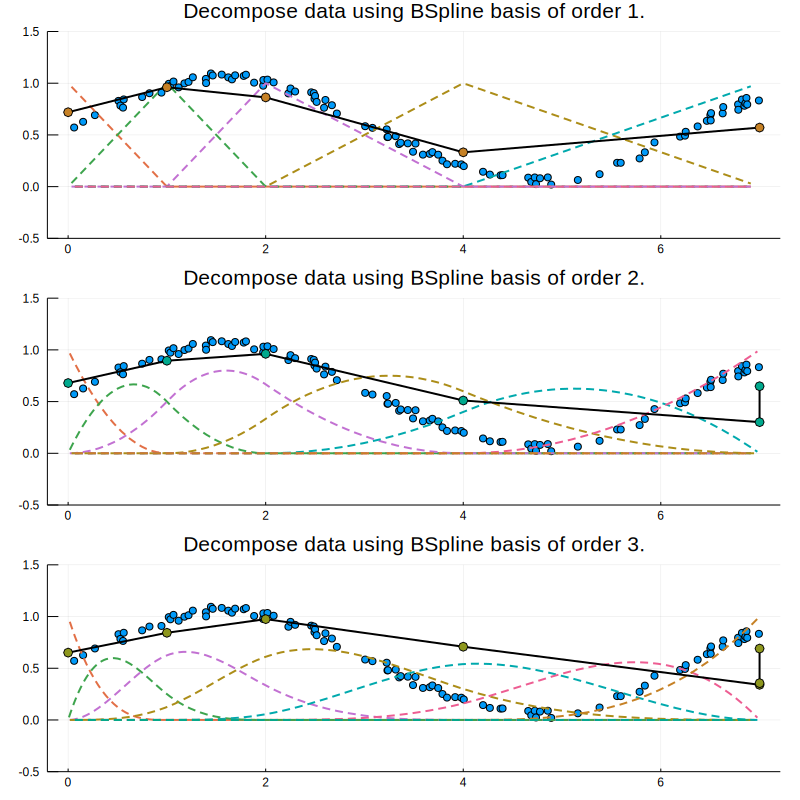

# BSplineFit.jl - Fitting and evaluating BSplines

## Creating BSplines
Atm. two kinds of splines can be constructed, `BSpline1D` and its basis functions `BSpline1DBasis`:
```julia
b = BSpline1D(order, knots, [coeffs])
b = BSpline1DBasis(order, knots, id)
```

## Fitting from data
To fit a BSpline from data, use the `fit` function as follows:
```julia
# define knots and order
order = 1
knots = [0.0,1.0,2.0,4.0,7.0]
# draw data points
data_x = sort(rand(100)*7)
data_y = rand(100)*0.1 .+ 0.5 .+ sin.(data_x)./2

# fit BSpline
bf = fit(data_x, data_y, order, knots)
plot(t->bf(t), 0, 7)
```

The example [examples/plot.jl](examples/fit.jl) demonstrates the usage and produces the following output:


## Decomposing data
To decompose a dataset into the weighted linear combinations 

(cᵢ= ∑ⱼfᵢ(xⱼ)⋅yⱼ) / (),  

where fᵢ are the basis
functions of BSpline, xⱼ are the N locations of data points and yⱼ are the respective values,
 use the `decompose` function as follows:
```julia
# define knots and order
order = 1
knots = [0.0,1.0,2.0,4.0,7.0]
# draw data points
data_x = sort(rand(100)*7)
data_y = rand(100)*0.1 .+ 0.5 .+ sin.(data_x)./2

# fit BSpline
loc,freq = decompose(data_x, data_y, order, knots)
plot(loc,freq)
```

**WARNING: HIGHER ORDER DECOMPOSITIONS DON'T MAKE SENSE ATM.!**

The example [examples/plot.jl](examples/decompose.jl) demonstrates the usage and produces the following output:


